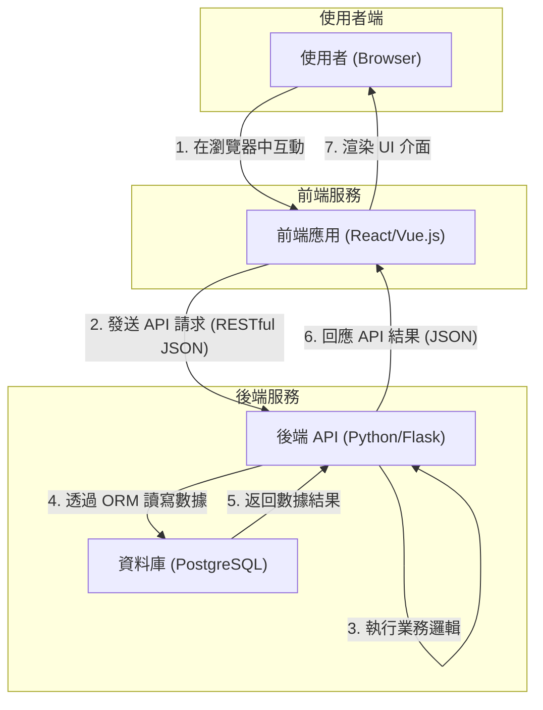

# 高階設計文檔 (High-Level Design)

**文件版本:** v1.0.0
**作者:** Gemini (軟體架構師)

---

## 1. 架構總覽 (Architecture Overview)

為了實現最大的靈活性與可擴展性，`MindTrack` 專案將採用「**前後端分離 (Headless)**」的現代 Web 架構。

此架構選擇基於以下三個核心設計原則：

1.  **獨立開發與部署 (Independent Development & Deployment)**: 前端團隊與後端團隊可以使用各自偏好的工具鏈與開發節奏，並獨立進行版本迭代與部署，從而顯著提升開發效率。
2.  **技術棧靈活性 (Technology Stack Flexibility)**: 後端 API 作為一個獨立的服務，未來可以為多種客戶端提供支援，例如在 MVP 成功後，我們可以輕鬆地開發原生行動應用 (iOS/Android) 來存取同一套 API，而無需修改後端邏輯。
3.  **更好的擴展性 (Improved Scalability)**: 我們可以根據實際負載，獨立地擴展前端（例如，透過 CDN）與後端（例如，增加 API 伺服器實例）的資源，使成本效益最大化。

前後端之間將透過 **RESTful API** 進行標準化通訊，並以 **JSON** 作為統一的數據交換格式。

## 2. 技術選型與理由 (Technology Stack & Justification)

以下為 MVP 階段後端開發的核心技術選型：

| 技術領域 | 選擇 | 選擇理由 (WHY) |
| :--- | :--- | :--- |
| **Web 框架** | **Flask** | 輕量、靈活、無侵入性，非常適合 MVP 的快速啟動與原型開發。其豐富的生態（如 Blueprints）能完美支持我們規劃的模組化架構。 |
| **資料庫** | **PostgreSQL** / **SQLite** | **PostgreSQL** 是一個功能強大、穩定可靠的開源關聯式資料庫，能滿足未來複雜數據分析的需求。在本地開發環境則使用 **SQLite**，因其無需設定、便於管理。 |
| **ORM** | **SQLAlchemy** | Python 世界中最強大、最主流的 ORM 函式庫，能以物件導向的方式操作資料庫，讓程式碼更乾淨、更易於在不同資料庫之間遷移。 |
| **資料驗證** | **Marshmallow** | 與 Flask 和 SQLAlchemy 能無縫整合，用於 API 請求/回應的序列化與反序列化，以及複雜的數據驗證，從而保障 API 入口端的數據完整性。 |

## 3. 後端專案結構 (Backend Project Structure)

我們將採用 **Flask Blueprints** 來組織專案程式碼。其核心目的是實現「**關注點分離 (Separation of Concerns)**」，將應用程式分解為一系列功能內聚、彼此解耦的模組。這使得程式碼更容易理解、測試與維護。

推薦的專案結構如下：

```
mindtrack_backend/
├── app/
│   ├── __init__.py         # App 工廠：初始化 Flask 應用與擴充套件
│   ├── blueprints/         # 存放所有功能藍圖 (Blueprint)
│   │   ├── __init__.py
│   │   ├── auth.py         # 職責：處理使用者註冊、登入、Token 管理等身份驗證
│   │   ├── habits.py       # 職責：處理習慣的 CRUD 與每日打卡記錄
│   │   └── moods.py        # 職責：處理每日心情的記錄
│   ├── models.py           # 職責：定義 SQLAlchemy 資料庫模型 (User, Habit, MoodLog 等)
│   ├── services/           # 職責：放置核心業務邏輯 (例如：習慣與心情的關聯性分析)
│   └── utils/              # 職責：存放通用工具函數、裝飾器等
├── migrations/             # 存放 Alembic/Flask-Migrate 的資料庫遷移腳本
├── tests/                  # 存放單元測試與整合測試
├── config.py               # 存放不同環境（開發、測試、生產）的配置
├── requirements.txt        # 專案的 Python 依賴列表
└── run.py                  # 啟動應用程式的進入點
```

## 4. 高階架構圖 (High-Level Architecture Diagram)


