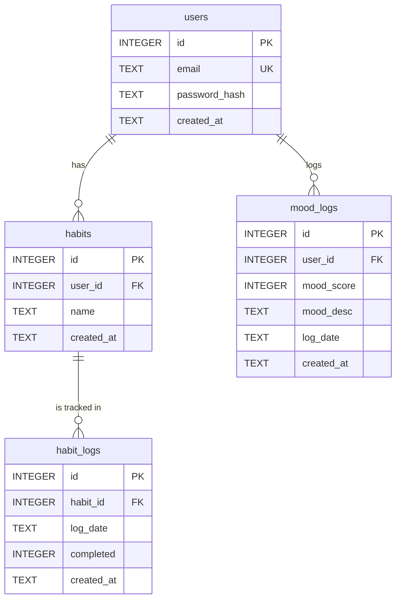

# 資料庫綱要定義文檔

**文件版本:** v1.0.0
**作者:** Gemini (資料庫管理員)

---

## 1. 設計原則與選型

-   **正規化 (Normalization)**: 本次綱要設計遵循**第三正規化 (3NF)**。我們將實體（如使用者、習慣定義、習慣紀錄）分離到各自的資料表中，透過外鍵進行關聯，以消除數據冗餘，確保資料的一致性與完整性。
-   **資料庫引擎**: **SQLite**。此選型主要基於 MVP 階段的需求：
    1.  **輕量級與零配置**: SQLite 是一個無伺服器的資料庫引擎，所有數據存儲在單一檔案中，極大地簡化了開發環境的搭建與部署流程。
    2.  **易於整合與測試**: Python 內建對 SQLite 的支援，能與 Flask 框架無縫整合，非常適合快速原型開發與自動化測試。

## 2. 資料表定義

### `users`

-   **用途說明**: 存儲應用程式的使用者帳號資訊與基本資料。

| 欄位名稱 | 資料類型 (SQLite) | 約束/索引 | 欄位描述 |
| :--- | :--- | :--- | :--- |
| `id` | `INTEGER` | `PK`, `AUTOINCREMENT` | 使用者的唯一識別碼 |
| `email` | `TEXT` | `UNIQUE`, `NOT NULL`, `INDEX` | 使用者登入的電子郵件 |
| `password_hash` | `TEXT` | `NOT NULL` | 加密後的密碼雜湊值 |
| `created_at` | `TEXT` | `NOT NULL` | 帳號建立時間 (ISO 8601) |

### `habits`

-   **用途說明**: 存儲由使用者自訂的習慣名稱與定義。

| 欄位名稱 | 資料類型 (SQLite) | 約束/索引 | 欄位描述 |
| :--- | :--- | :--- | :--- |
| `id` | `INTEGER` | `PK`, `AUTOINCREMENT` | 習慣的唯一識別碼 |
| `user_id` | `INTEGER` | `FK`, `NOT NULL`, `INDEX` | 關聯到 `users(id)` |
| `name` | `TEXT` | `NOT NULL` | 習慣的名稱，例如「晨間運動」 |
| `created_at` | `TEXT` | `NOT NULL` | 習慣建立時間 (ISO 8601) |

### `mood_logs`

-   **用途說明**: 記錄使用者每日的心情分數，確保每日僅有一筆記錄。

| 欄位名稱 | 資料類型 (SQLite) | 約束/索引 | 欄位描述 |
| :--- | :--- | :--- | :--- |
| `id` | `INTEGER` | `PK`, `AUTOINCREMENT` | 心情記錄的唯一識別碼 |
| `user_id` | `INTEGER` | `FK`, `NOT NULL`, `INDEX` | 關聯到 `users(id)` |
| `mood_score` | `INTEGER` | `NOT NULL` | 心情分數（例如 1 到 5） |
| `mood_desc` | `TEXT` | `NULLABLE` | 心情小語句描述（例如 感覺不錯） |
| `log_date` | `TEXT` | `NOT NULL`, `INDEX` | 記錄日期 (`YYYY-MM-DD`) |
| `created_at` | `TEXT` | `NOT NULL` | 記錄建立時間 (ISO 8601) |
| `(user_id, log_date)` | | `UNIQUE` | 確保每個使用者每天只有一筆心情記錄 |

### `habit_logs`

-   **用途說明**: 記錄特定習慣在某一天的完成狀態。

| 欄位名稱 | 資料類型 (SQLite) | 約束/索引 | 欄位描述 |
| :--- | :--- | :--- | :--- |
| `id` | `INTEGER` | `PK`, `AUTOINCREMENT` | 習慣記錄的唯一識別碼 |
| `habit_id` | `INTEGER` | `FK`, `NOT NULL`, `INDEX` | 關聯到 `habits(id)` |
| `log_date` | `TEXT` | `NOT NULL`, `INDEX` | 記錄日期 (`YYYY-MM-DD`) |
| `completed` | `INTEGER` | `NOT NULL` | 完成狀態 (1: 已完成, 0: 未完成) |
| `created_at` | `TEXT` | `NOT NULL` | 記錄建立時間 (ISO 8601) |
| `(habit_id, log_date)` | | `UNIQUE` | 確保每個習慣每天只有一筆完成記錄 |

## 3. 實體關係圖 (Entity-Relationship Diagram - ERD)



## 4. 關聯文字說明

-   **`users` 與 `habits`**: 一對多關係。一個使用者可以建立多個習慣。
-   **`users` 與 `mood_logs`**: 一對多關係。一個使用者可以擁有多筆每日心情記錄。
-   **`habits` 與 `habit_logs`**: 一對多關係。一個習慣定義可以擁有多筆不同日期的完成記錄。

## 5. 資料庫填充腳本 (Database Seeding Script)

```sql
-- SQLite Seeding Script for MindTrack

-- 清除舊資料 (方便重複執行)
DELETE FROM habit_logs;
DELETE FROM mood_logs;
DELETE FROM habits;
DELETE FROM users;

-- 插入一位範例使用者
INSERT INTO users (id, email, password_hash, created_at) VALUES
(1, 'dev.user@example.com', 'scrypt:32768:8:1$samplesalt$samplehash', '2026-01-28 10:00:00');

-- 為該使用者插入兩個習慣
INSERT INTO habits (id, user_id, name, created_at) VALUES
(1, 1, '晨間運動 30 分鐘', '2026-01-28 10:05:00'),
(2, 1, '每日冥想 10 分鐘', '2026-01-28 10:06:00');

-- 插入幾天的心情記錄
INSERT INTO mood_logs (user_id, mood_score,mod_desc, log_date, created_at) VALUES
(1, 4, '運動完感覺很好', '2026-01-25', '2026-01-25 21:00:00'),
(1, 5, '有點累', '2026-01-26', '2026-01-26 21:00:00'),
(1, 3, '普通', '2026-01-27', '2026-01-27 21:00:00'),
(1, 5, '再接再勵', '2026-01-28', '2026-01-28 21:00:00');

-- 插入幾天的習慣完成記錄
-- 晨間運動 (Habit ID: 1)
INSERT INTO habit_logs (habit_id, log_date, completed, created_at) VALUES
(1, '2026-01-25', 0, '2026-01-25 22:00:00'),
(1, '2026-01-26', 1, '2026-01-26 22:00:00'),
(1, '2026-01-27', 0, '2026-01-27 22:00:00'),
(1, '2026-01-28', 1, '2026-01-28 08:00:00');

-- 每日冥想 (Habit ID: 2)
INSERT INTO habit_logs (habit_id, log_date, completed, created_at) VALUES
(2, '2026-01-25', 1, '2026-01-25 22:05:00'),
(2, '2026-01-26', 1, '2026-01-26 22:05:00'),
(2, '2026-01-27', 1, '2026-01-27 22:05:00'),
(2, '2026-01-28', 1, '2026-01-28 22:05:00');

```
