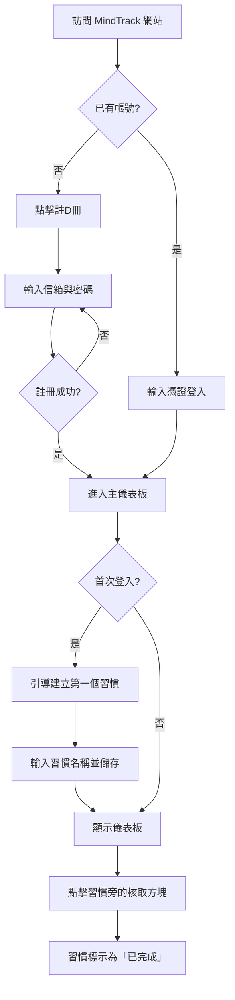

**版本:** 1.0
**作者:** Gemini (產品經理)

---

# 核心使用者故事 (Core User Stories)

以下是根據專案章程中 MVP 範圍所定義的 5 個最核心使用者故事，聚焦於新使用者從註冊到首次體驗產品核心價值的關鍵路徑。

### 1. 新使用者註冊

-   **使用者故事**: As a `追求個人成長的新訪客`, I want to `透過電子郵件和密碼快速註冊一個新帳號`, so that `我可以開始使用應用程式來追蹤我的個人成長`。
-   **驗收標準 (Acceptance Criteria)**:
    1.  `Given` 一位訪客正在註冊頁面, `When` 他輸入一組有效的電子郵件與密碼並點擊「註冊」, `Then` 他的帳號被成功建立，並自動登入系統。
    2.  `Given` 一位訪客正在註冊頁面, `When` 他嘗試使用一個已存在的電子郵件進行註冊, `Then` 頁面會顯示一則錯誤訊息：「此電子郵件已被註冊」。
    3.  `Given` 一位訪客正在註冊頁面, `When` 他輸入一個格式不正確的電子郵件, `Then` 輸入框下方會即時顯示格式錯誤的提示。

### 2. 首次引導建立習慣

-   **使用者故事**: As a `首次登入的使用者`, I want to `被引導建立我的第一個追蹤習慣`, so that `我能立即開始我的追蹤旅程，而不會感到迷惘`。
-   **驗收標準 (Acceptance Criteria)**:
    1.  `Given` 一位使用者剛剛完成註冊並首次進入儀表板, `When` 頁面載入完成, `Then` 一個提示框或引導流程會出現，邀請他新增第一個習慣。
    2.  `Given` 使用者正在「新增習慣」的提示框中, `When` 他輸入習慣名稱（例如：「冥想 10 分鐘」）並點擊儲存, `Then` 這個新習慣會出現在他的主儀表板上。
    3.  `Given` 使用者正在建立新習慣, `When` 他嘗試儲存一個空白名稱的習慣, `Then` 儲存按鈕會是無效狀態，並提示他需要輸入名稱。

### 3. 每日記錄心情

-   **使用者故事**: As a `每日返回的使用者`, I want to `能夠在儀表板上透過一次點擊就完成今日心情記錄`, so that `我可以快速捕捉當下感受，而不會中斷我的心流`。
-   **驗收標準 (Acceptance Criteria)**:
    1.  `Given` 一位使用者在他的主儀表板上, `When` 他點擊一個代表今日心情的表情符號, `Then` 系統會記錄下今天的心情，且該符號會呈現被選中的狀態。
    2.  `Given` 一位使用者今天已經記錄過心情, `When` 他點擊了另一個不同的心情符號, `Then` 系統會更新今天的心情記錄，而不是新增一筆。
    3.  `Given` 一位使用者在同一天再次訪問儀表板, `When` 頁面載入, `Then` 他能看到先前已選擇的心情符號。

### 4. 每日完成習慣打卡

-   **使用者故事**: As a `想要建立正向循環的使用者`, I want to `能夠在儀表板上簡單地勾選我今天已完成的習慣`, so that `我可以獲得即時的成就感並保持動力`。
-   **驗收標準 (Acceptance Criteria)**:
    1.  `Given` 使用者的儀表板上至少有一個習慣, `When` 他點擊該習慣旁邊對應今天的核取方塊, `Then` 該習慣在今天會被標示為「已完成」。
    2.  `Given` 一個習慣已被標示為「已完成」, `When` 使用者再次點擊同一個核取方塊, `Then` 該習慣會被更新為「未完成」狀態。
    3.  `Given` 一位使用者已連續 3 天完成某個習慣, `When` 他在第 4 天再次將其標示為「已完成」, `Then` 儀表板上顯示的連續天數會更新為 4。

### 5. 檢視關聯性洞察

-   **使用者故事**: As a `持續記錄數據的使用者`, I want to `在儀表板上看到我的心情趨勢與習慣執行的關聯圖表`, so that `我能發現自己行為與感受之間的潛在連結`。
-   **驗收標準 (Acceptance Criteria)**:
    1.  `Given` 一位使用者已經記錄了至少 3 天的心情與某個特定習慣, `When` 他查看儀表板的圖表區塊, `Then` 他會看到一條顯示心情分數變化的趨勢線。
    2.  `Given` 心情趨勢圖表已顯示, `When` 使用者在圖表上方的篩選器選擇一個習慣, `Then` 圖表會疊加該習慣的完成記錄（例如：以圓點標示）在心情趨勢線上。
    3.  `Given` 使用者記錄的數據少于 3 天, `When` 他查看圖表區塊, `Then` 他會看到一則鼓勵訊息，例如：「持續記錄，洞察即將揭曉！」。

# 使用者流程圖 (User Flow Diagram)

此流程圖聚焦於「新使用者從進入網站到完成第一次習慣打卡」的關鍵路徑。

## 流程圖詳細說明

1.  **訪問網站 & 帳號判斷**: 這是使用者旅程的起點。系統首先需要判斷使用者的身分（新訪客或舊用戶），以便提供最適合的下一步操作（註冊或登入）。**WHY**: 為了給予不同使用者最直接的路徑，減少不必要的點擊，避免讓老用戶重複看到註冊引導。
2.  **註冊流程 (E-F)**: 根據專案章程，我們需要一個「簡單、無壓力」的工具。因此，註冊流程被設計為僅需最核心的信箱與密碼。**WHY**: 降低使用者進入的門檻，快速捕獲潛在用戶，符合 MVP 階段「快速獲取使用者」的目標。
3.  **引導建立第一個習慣 (I-J)**: 這是整個流程的關鍵轉折點。對於新用戶，一個空白的儀表板是令人困惑且無助的。**WHY**: 透過主動引導，我們能確保使用者立即體驗到產品的核心循環（建立 -> 追蹤），這一步是為了消除「空狀態焦慮」，並為使用者創造第一個「承諾」，提高後續回訪的可能性。
4.  **顯示儀表板 (K)**: 儀表板是使用者的「家」，所有核心互動都在此發生。**WHY**: 設計的核心是將最高頻的操作（記錄心情、打卡習慣）放在最顯眼的位置，讓使用者可以「不用思考」就完成每日記錄，這直接對應了「提升每日記錄率」的成功指標。
5.  **完成第一次習慣打卡 (L-M)**: 這是使用者第一次從產品中獲得正向反饋的時刻。點擊核取方塊這個微小的互動，提供了即時的滿足感。**WHY**: 這個動作是整個習慣養成循環的閉環。它不僅是使用者個人的一次小勝利，也是我們收集到第一個「行為數據」的時刻，為最終的「關聯性洞察」功能奠定了基礎。
